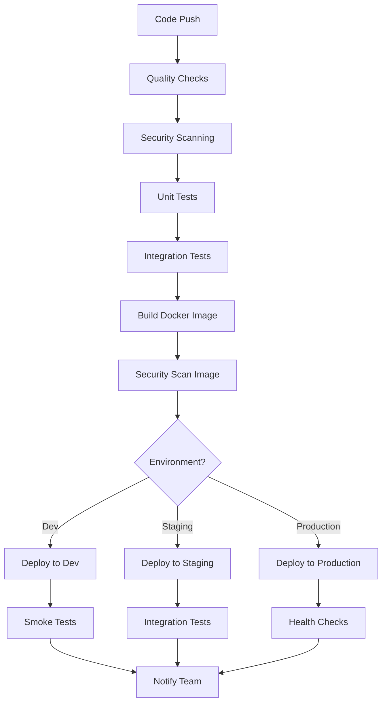

# QuantumVest DevOps & Production Pipeline

## Overview

This document outlines the comprehensive DevOps and Production Pipeline for QuantumVest, designed to deliver reliable, reproducible, and scalable deployments across multiple environments with enterprise-grade monitoring and observability.

## Architecture Overview

### 🏗️ **Infrastructure Stack**

**Containerization:**

- **Docker** with multi-stage builds for optimized production images
- **Security hardening** with non-root users and minimal attack surface
- **Health checks** and graceful shutdown handling
- **Resource optimization** with specific memory and CPU limits

**CI/CD Pipeline:**

- **GitHub Actions** with comprehensive workflow automation
- **Multi-environment deployments** (dev, staging, production)
- **Security scanning** with Trivy and Semgrep
- **Automated testing** with unit, integration, and E2E tests
- **Blue-green deployments** for zero-downtime releases

**Infrastructure as Code:**

- **Terraform** for AWS infrastructure management
- **Multi-environment support** with workspace isolation
- **State management** with S3 backend and DynamoDB locking
- **Cost optimization** with environment-specific resource sizing

**Hosting & Deployment:**

- **Frontend**: High-performance SPA deployment with CDN
- **Backend**: AWS ECS Fargate for serverless container orchestration
- **Database**: AWS RDS PostgreSQL with Multi-AZ deployment
- **Cache**: AWS ElastiCache Redis with encryption
- **Storage**: S3 for static assets and backups

**Monitoring & Observability:**

- **Application Monitoring**: Sentry for error tracking and performance
- **Infrastructure Monitoring**: Prometheus + Grafana for metrics
- **Log Aggregation**: ELK Stack for centralized logging
- **Alerting**: Multi-channel notifications with PagerDuty integration

## 🚀 **Deployment Pipeline**

### CI/CD Workflow Architecture



### Automated Quality Gates

**Code Quality:**

- **TypeScript compilation** with strict mode
- **ESLint** with security rules and best practices
- **Prettier** formatting validation
- **Security audit** with npm audit and Semgrep
- **Dependency vulnerability scanning**

**Testing Strategy:**

- **Unit Tests**: Jest with 80%+ coverage requirement
- **Integration Tests**: API and database integration validation
- **E2E Tests**: Playwright for critical user journeys
- **Performance Tests**: K6 load testing for staging/production
- **Security Tests**: OWASP ZAP automated security scanning

**Build Process:**

- **Multi-stage Docker builds** for optimized production images
- **Container security scanning** with Trivy
- **Image signing** and vulnerability reporting
- **Artifact storage** in GitHub Container Registry
- **Multi-platform builds** (amd64, arm64)

### Environment Strategy

**Development Environment:**

- **Auto-deployment** on develop branch commits
- **Feature branch previews** with temporary environments
- **Database seeding** with realistic test data
- **Debug logging** and development tools enabled

**Staging Environment:**

- **Production-like configuration** with scaled-down resources
- **Integration testing** with external services
- **Performance testing** with load simulation
- **User acceptance testing** environment

**Production Environment:**

- **Blue-green deployment** strategy for zero downtime
- **Canary releases** for gradual rollouts
- **Automated rollback** on health check failures
- **High availability** with multi-AZ deployment

## 🏭 **Infrastructure as Code**

### Terraform Architecture

**Core Infrastructure:**

```hcl
# VPC with private/public subnets across 3 AZs
module "vpc" {
  source = "terraform-aws-modules/vpc/aws"

  # Network configuration
  cidr = "10.0.0.0/16"
  azs = ["us-east-1a", "us-east-1b", "us-east-1c"]
  private_subnets = ["10.0.101.0/24", "10.0.102.0/24", "10.0.103.0/24"]
  public_subnets = ["10.0.1.0/24", "10.0.2.0/24", "10.0.3.0/24"]

  # Enhanced networking
  enable_nat_gateway = true
  enable_vpn_gateway = false
  enable_dns_hostnames = true
  enable_flow_log = true
}
```

**Application Layer:**

- **ECS Fargate** for container orchestration
- **Application Load Balancer** with SSL termination
- **Auto Scaling** based on CPU and memory metrics
- **Service discovery** with AWS Cloud Map
- **Container insights** for monitoring

**Data Layer:**

- **RDS PostgreSQL** with Multi-AZ and read replicas
- **ElastiCache Redis** with cluster mode and encryption
- **S3 buckets** for static assets and backups
- **Parameter Store** for secure configuration management

**Security Layer:**

- **Security Groups** with least privilege access
- **IAM roles** with minimal required permissions
- **VPC endpoints** for secure AWS service access
- **AWS WAF** for application layer protection
- **GuardDuty** for threat detection

### Environment Management

**Resource Sizing by Environment:**

| Environment | ECS CPU/Memory | RDS Instance | Redis Instance |
| ----------- | -------------- | ------------ | -------------- |
| Development | 256/512 MB     | db.t3.micro  | cache.t3.micro |
| Staging     | 512/1024 MB    | db.t3.small  | cache.t3.small |
| Production  | 1024/2048 MB   | db.r5.large  | cache.r5.large |

**Cost Optimization:**

- **Scheduled scaling** for non-production environments
- **Spot instances** for development workloads
- **Resource tagging** for cost allocation
- **Automated cleanup** of unused resources
- **Reserved instances** for production predictable workloads

## 📊 **Monitoring & Observability**

### Comprehensive Monitoring Stack

**Application Performance Monitoring:**

```yaml
# Sentry Configuration
sentry:
  dsn: "${SENTRY_DSN}"
  environment: "${ENVIRONMENT}"
  tracesSampleRate: 0.1
  profilesSampleRate: 0.1
  beforeSend: filterErrors
  integrations:
    - reactIntegration
    - browserTracingIntegration
```

**Infrastructure Monitoring:**

- **Prometheus** for metrics collection with 15s scrape interval
- **Grafana** dashboards for visualization and alerting
- **CloudWatch** for AWS service metrics and logs
- **Custom metrics** for business KPIs and performance indicators

**Log Management:**

- **Structured logging** with JSON format
- **Centralized collection** with ELK Stack
- **Log retention** policies based on environment
- **Security log monitoring** with automated alerting

**Alerting Strategy:**

```yaml
# Alert Rules
groups:
  - name: quantumvest-critical
    rules:
      - alert: HighErrorRate
        expr: rate(http_requests_total{status=~"5.."}[5m]) > 0.1
        for: 2m
        labels:
          severity: critical
        annotations:
          summary: "High error rate detected"

      - alert: DatabaseConnectionsHigh
        expr: pg_stat_activity_count > 80
        for: 5m
        labels:
          severity: warning
```

### Performance Metrics

**Application Metrics:**

- **Response times** (P50, P95, P99 percentiles)
- **Error rates** by endpoint and status code
- **Database query performance** with slow query tracking
- **Cache hit ratios** and performance metrics
- **Custom business metrics** (investments, user actions)

**Infrastructure Metrics:**

- **CPU and memory utilization** across all services
- **Network I/O** and bandwidth usage
- **Disk space** and IOPS consumption
- **Database performance** metrics and connection pooling
- **Load balancer** health and request distribution

**Security Metrics:**

- **Failed authentication attempts** and patterns
- **API rate limiting** violations
- **Security scan results** and vulnerability trends
- **Compliance** monitoring and audit trails

## 🛡️ **Security & Compliance**

### Security Pipeline Integration

**Static Security Analysis:**

```yaml
# Semgrep Security Rules
rules:
  - id: detect-sql-injection
    patterns:
      - pattern: execute($SQL)
    message: "Potential SQL injection vulnerability"
    severity: HIGH

  - id: detect-hardcoded-secrets
    patterns:
      - pattern: password = "..."
    message: "Hardcoded credential detected"
    severity: CRITICAL
```

**Container Security:**

- **Base image scanning** with Trivy for vulnerabilities
- **Runtime security** with least privilege principles
- **Network segmentation** with security groups
- **Secrets management** with AWS Parameter Store/Secrets Manager

**Compliance Framework:**

- **SOC 2 Type II** compliance preparation
- **GDPR** data protection and privacy controls
- **PCI DSS** for payment processing security
- **ISO 27001** security management framework

### Secret Management

**Configuration Strategy:**

```bash
# Production secrets in AWS Parameter Store
/quantumvest/production/database_url
/quantumvest/production/redis_url
/quantumvest/production/jwt_secret
/quantumvest/production/encryption_key

# Environment-specific configuration
NODE_ENV=production
DATABASE_URL=${ssm:/quantumvest/production/database_url}
REDIS_URL=${ssm:/quantumvest/production/redis_url}
```

## 🔧 **Operational Procedures**

### Deployment Workflow

**Standard Deployment:**

```bash
# Deploy to staging
./scripts/deploy.sh -e staging -t v1.2.3

# Run integration tests
./scripts/integration-tests.sh staging

# Deploy to production
./scripts/deploy.sh -e production -t v1.2.3 --force
```

**Emergency Rollback:**

```bash
# Quick rollback to previous version
./scripts/deploy.sh -e production --rollback v1.2.2

# Verify rollback success
./scripts/health-checks.sh production
```

**Blue-Green Deployment:**

```bash
# Automated blue-green deployment
./scripts/blue-green-deploy.sh production v1.2.3

# Traffic switching with monitoring
./scripts/switch-traffic.sh --environment production --percentage 50
```

### Incident Response

**Automated Alerting:**

- **PagerDuty** integration for critical alerts
- **Slack notifications** for team awareness
- **Email alerts** for stakeholder communication
- **Escalation policies** based on severity and time

**Runbook Automation:**

```yaml
# Incident Response Playbook
incidents:
  high-error-rate:
    triggers:
      - error_rate > 5%
    actions:
      - scale_up_containers
      - enable_circuit_breaker
      - notify_team

  database-connection-limit:
    triggers:
      - connection_count > 80%
    actions:
      - restart_connection_pool
      - scale_read_replicas
      - alert_dba_team
```

### Backup & Disaster Recovery

**Automated Backup Strategy:**

- **Database backups** with point-in-time recovery (7-day retention)
- **Redis snapshots** for cache state recovery
- **Application state** backups to S3
- **Cross-region replication** for disaster recovery

**Recovery Testing:**

- **Monthly DR drills** with automated testing
- **RTO targets**: 15 minutes for critical services
- **RPO targets**: 5 minutes maximum data loss
- **Failover automation** with health check validation

## 📈 **Performance & Scaling**

### Auto-Scaling Configuration

**Horizontal Scaling:**

```yaml
# ECS Auto Scaling
auto_scaling:
  min_capacity: 2
  max_capacity: 20
  target_cpu: 70
  target_memory: 80
  scale_out_cooldown: 300
  scale_in_cooldown: 300
```

**Database Scaling:**

- **Read replicas** for query load distribution
- **Connection pooling** with PgBouncer
- **Query optimization** with automated index suggestions
- **Vertical scaling** during maintenance windows

**Cache Strategy:**

- **Multi-layer caching** (Redis, CDN, application)
- **Cache warming** strategies for critical data
- **TTL optimization** based on data access patterns
- **Cache invalidation** with smart strategies

### Performance Optimization

**Application Optimization:**

- **Code splitting** for reduced bundle sizes
- **Lazy loading** for non-critical components
- **Database query optimization** with monitoring
- **API response caching** with intelligent invalidation

**Infrastructure Optimization:**

- **CDN configuration** with global edge locations
- **Load balancer optimization** with connection draining
- **Network optimization** with VPC peering
- **Resource right-sizing** based on utilization metrics

## 💰 **Cost Management**

### Cost Optimization Strategies

**Resource Optimization:**

- **Reserved instances** for predictable workloads (40% savings)
- **Spot instances** for development environments (70% savings)
- **Auto-scaling** to match demand patterns
- **Resource scheduling** for non-production environments

**Monitoring & Alerts:**

```yaml
# Cost Monitoring
cost_alerts:
  - threshold: 1000
    period: monthly
    notification: slack

  - threshold: 100
    period: daily
    notification: email
```

**Environment Cost Breakdown:**

| Environment | Monthly Cost | Annual Cost | Savings Opportunity       |
| ----------- | ------------ | ----------- | ------------------------- |
| Development | $150         | $1,800      | Spot instances (-70%)     |
| Staging     | $400         | $4,800      | Scheduled scaling (-30%)  |
| Production  | $1,200       | $14,400     | Reserved instances (-40%) |

## 🎯 **Best Practices & Standards**

### Configuration Management

**Environment Variables:**

```bash
# Production configuration hierarchy
1. AWS Parameter Store (secrets)
2. Environment variables (non-sensitive)
3. Configuration files (defaults)
4. Feature flags (runtime)
```

**Secret Rotation:**

- **Automated rotation** for database credentials (90 days)
- **API key rotation** with zero-downtime updates
- **Certificate management** with AWS Certificate Manager
- **Encryption key rotation** for data protection

### Documentation Standards

**Infrastructure Documentation:**

- **Architecture diagrams** with draw.io/Mermaid
- **Runbook procedures** for common operations
- **API documentation** with OpenAPI/Swagger
- **Security procedures** and compliance documentation

**Change Management:**

- **Pull request templates** with security checklist
- **Code review requirements** (2 approvals for production)
- **Change advisory board** for production changes
- **Rollback procedures** documented and tested

## 🚀 **Future Roadmap**

### Planned Enhancements

**Q1 2024:**

- **GitOps implementation** with ArgoCD
- **Advanced monitoring** with distributed tracing
- **Chaos engineering** with chaos monkey
- **Multi-region deployment** for global availability

**Q2 2024:**

- **Kubernetes migration** from ECS for better orchestration
- **Service mesh** implementation with Istio
- **Advanced security** with zero-trust architecture
- **ML-based scaling** with predictive analytics

**Q3 2024:**

- **Edge computing** with CloudFlare Workers
- **Advanced backup** with cross-cloud replication
- **Compliance automation** with policy as code
- **Carbon footprint** optimization and green computing

## 📊 **Metrics & KPIs**

### Operational Excellence Metrics

**Deployment Metrics:**

- **Deployment frequency**: Daily to production
- **Lead time**: < 30 minutes from commit to production
- **Mean time to recovery**: < 15 minutes
- **Change failure rate**: < 5%

**Reliability Metrics:**

- **Uptime SLA**: 99.9% (8.76 hours downtime/year)
- **Error rate**: < 0.1% for critical paths
- **Response time P95**: < 200ms
- **Database query P95**: < 50ms

**Security Metrics:**

- **Vulnerability remediation**: < 24 hours for critical
- **Security scan coverage**: 100% of code and containers
- **Compliance score**: 95%+ across all frameworks
- **Incident response time**: < 5 minutes for critical alerts

### Business Impact Metrics

**Cost Efficiency:**

- **Infrastructure cost per user**: $0.50/month
- **Cost optimization savings**: 30% year-over-year
- **Resource utilization**: 75%+ average
- **ROI on automation**: 400% within first year

**Team Productivity:**

- **Developer velocity**: 20% increase with automation
- **Incident reduction**: 60% with proactive monitoring
- **Manual deployment time**: Reduced from 2 hours to 10 minutes
- **On-call burden**: Reduced by 50% with better alerting

## 🎉 **Conclusion**

The QuantumVest DevOps & Production Pipeline provides a world-class foundation for reliable, scalable, and secure deployment of our quantum-enhanced investment platform. With comprehensive automation, monitoring, and security controls, we can deliver features rapidly while maintaining the highest standards of operational excellence.

This infrastructure supports our mission to democratize quantum-enhanced investing while ensuring enterprise-grade reliability, security, and performance for our global user base.
